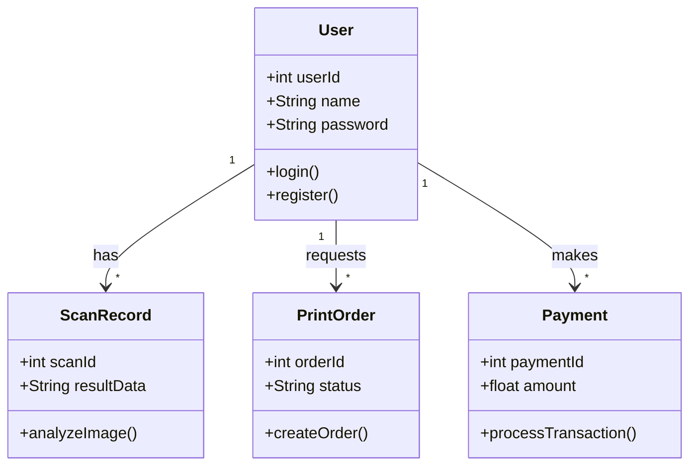
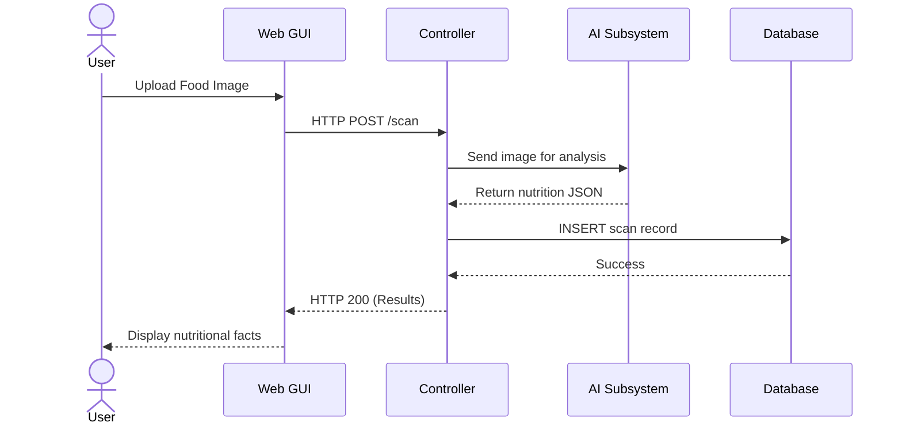

# SOFTWARE DEVELOPMENT LAB MANUAL

**Project Name:** NutriFact Analyser  
**Type:** Web Application / AI-based Health Assistant  

**System Description:**  
NutriFact Analyser is an intelligent web application designed to help users understand the nutritional value and health impacts of packaged foods and raw meals. By utilizing AI and image scanning technology, the application extracts dietary information from food labels or photos and provides a comprehensive breakdown of ingredients, calorie counts, and potential health warnings. It also incorporates user management, subscription payments, report printing, and notification features for a complete web application experience.

---

## EX no : 01 – SOFTWARE REQUIREMENT SPECIFICATION

**1. Problem Statement**
Consumers often find it difficult to interpret complex nutritional labels on packaged foods, leading to uninformed dietary choices and potential health problems. There is an urgent need for an automated system to scan, analyze, and simplify these nutritional facts while highlighting health risks clearly.

**2. Introduction**
NutriFact Analyser is a software application built to analyze food nutrition labels and food images. It bridges the gap between complex dietary terminologies and everyday consumers, offering immediate feedback on the health implications of consumed food items.

**3. Scope**
The scope encompasses user account management, image uploading, AI-based nutritional data extraction, health warning identification, generation of printable analytical reports, and processing of premium subscriptions for advanced dietary tracking.

**4. Purpose**
To simplify nutritional information, promote healthier lifestyle choices, and provide an accessible digital platform for tracking and evaluating daily nutritional intake.

**5. Overall Description**
The product is a multi-tier web application featuring a frontend user interface, a backend processing layer handling AI integration and business logic, and a database layer for maintaining user data, analysis history, print orders, and payment transactions.

**6. Product Perspective**
This system operates as a standalone web application interacting with external AI service APIs (like Gemini) to process images. It replaces manual calorie-counting and label-reading with automated analysis.

**7. Product Features**
- Secure User Authentication & Profile Management.
- AI-Driven Food Label and Photo Scanning.
- Generation and Printing of Nutritional Reports (Print Order Management).
- Premium User Subscriptions (Payment Module).
- Dietary Alerts and System Notifications.

**8. User Classes and Characteristics**
- **Student / General User:** Health-conscious individuals seeking to scan food items. They require an intuitive, highly responsive UI without clinical complexity.
- **Faculty / Dietitian:** Advanced users viewing detailed breakdown reports and advising users.
- **Admin:** System administrators managing the database, monitoring payments, and overseeing system health.

**9. Operating Environment**
- **Client Side:** Modern web browsers (Chrome, Firefox, Safari) on Desktop or Mobile OS.
- **Server Side:** Web server supporting Java Servlets and Node.js environments.
- **Database:** Relational Database Management System (e.g., MySQL or Oracle).

**10. Design and Implementation Constraints**
- Accurate extraction heavily depends on user-uploaded image clarity.
- Requires constant internet connectivity for external AI API calls.
- Must ensure data protection and secure handling of user credentials and payment data.

**11. System Features**
- **Core Processing Engine:** Image upload handling and seamless API communication.
- **Data Persistence:** JDBC-based connections storing user logs, print requests, and payments.
- **Dynamic Reporting:** Exporting user nutrition data into printable formats.

**12. External Interface Requirements (UI, Hardware, Software)**
- **UI:** A modern, accessible web dashboard featuring scan buttons and history tables.
- **Hardware:** Device camera or local storage for image input; network interface.
- **Software:** Requires operating systems that support HTML5 semantics and secure HTTP (HTTPS) protocols.

**13. Functional Requirements**
- The system shall allow users to register, log in, and reset passwords.
- The system shall accept image uploads (`.png`, `.jpg`) for analysis.
- The system shall allow ordering and tracking of printed dietary reports.
- The system shall handle payment gateway integration for subscription upgrades.

**14. Non-Functional Requirements**
- **Performance:** AI analysis turnaround time should be under 5 seconds on average.
- **Security:** Passwords encrypted using hashing algorithms; payment gateways via TLS.
- **Reliability & Availability:** 99.9% uptime target for the application interface.

---

## EX no : 02 – UML USE CASE DIAGRAM

**1. Introduction**
A Use Case Diagram illustrates the functional requirements of the NutriFact Analyser by showing the interactions between the system and its external actors.

**2. Actors**
- **Student (User):** Interacts with scanning, history, printing, and payment features.
- **Faculty (Dietitian):** Reviews user data, verifies reports.
- **Admin:** Manages platform users, updates system settings, checks payment logs.

**3. Use Cases List**
- Register/Login
- Scan Food Label / Upload Image
- View Analysis Results
- Order Print Report
- Make Payment
- Manage Notifications
- Manage Users (Admin)

**4. Detailed Description of Each Use Case**
- **Scan Food Label:** User uploads an image; the system parses the image via AI and returns ingredients and calorie metrics.
- **Order Print Report:** User requests a physical or PDF copy of their nutritional history. The system logs the print order.
- **Make Payment:** User initiates a transaction to upgrade to a premium account; the system securely processes the transaction.

**5. Relationships (Include / Extend)**
- **«include»:** *Scan Food Label* includes *Authenticate User* (must be logged in). *Make Payment* includes *Verify Card Details*.
- **«extend»:** *Apply Promo Code* extends *Make Payment* (optional step). *Generate Health Warning* extends *View Analysis Results* (triggered only if bad ingredients are found).

**6. Use Case Flow Summary**
The core flow begins with user authentication. The user accesses the dashboard, chooses to scan a label, views the parsed data, and optionally orders a printed copy of the results or upgrades via the payment module. Admins independently log in to monitor these workflows.

```mermaid
usecaseDiagram
    actor Student
    actor Faculty
    actor Admin
    
    usecase "Login & Auth" as UC1
    usecase "Scan Food Label" as UC2
    usecase "Order Print Report" as UC3
    usecase "Make Payment" as UC4
    usecase "Verify Details" as UC5
    usecase "Manage Users" as UC6
    
    Student --> UC1
    Student --> UC2
    Student --> UC3
    Student --> UC4
    
    UC4 ..> UC5 : <<include>>
    UC2 ..> UC1 : <<include>>
    
    Faculty --> UC3
    Admin --> UC6
    Admin --> UC1
```

---

## EX no : 03 – CLASS DIAGRAM

**1. Introduction**
The Class Diagram models the static structure of the database and software architecture system, defining object-oriented classes, their attributes, and operations.

**2. List of Classes with attributes and methods**
- **User:** `userId`, `name`, `email`, `password`. Methods: `login()`, `register()`.
- **ScanRecord:** `scanId`, `imageUrl`, `resultData`, `scanDate`. Methods: `analyzeImage()`, `saveRecord()`.
- **PrintOrder:** `orderId`, `reportType`, `status`. Methods: `createOrder()`, `updateStatus()`.
- **Payment:** `paymentId`, `amount`, `date`, `status`. Methods: `processTransaction()`, `generateReceipt()`.
- **Notification:** `notifyId`, `message`, `isRead`. Methods: `sendNotification()`, `markAsRead()`.

**3. Relationships between classes (with explanation)**
- **User to ScanRecord (One-to-Many):** A single user can perform multiple scans.
- **User to PrintOrder (One-to-Many):** A user can place multiple print requests.
- **User to Payment (One-to-Many):** A user manages multiple payment invoices.
- **System to Notification (One-to-Many):** The system generates multiple notifications for a user.

**4. Diagram Explanation**
The `User` class acts as the central hub. Every `ScanRecord`, `PrintOrder`, and `Payment` must have a foreign key reference to the specific `User`. The classes encapsulate their specific database operations.

**5. Summary**
The class diagram enforces strict data encapsulation where payment logics and scan algorithms are separated into modular components, facilitating robust Java/OOP implementation.



---

## EX no : 04 – SEQUENCE DIAGRAM

**1. Introduction**
A Sequence Diagram demonstrates how objects in the NutriFact Analyser system operate with one another and in what order across a timeline.

**2. Actors and Components**
- Actors: User, Admin
- Components: Web GUI, Controller (Backend), Database, AI Subsystem.

**3. Step-by-step interaction flow**
1. User enters login credentials via Web GUI.
2. Web GUI sends data to Controller.
3. Controller verifies credentials with Database.
4. User uploads food image.
5. Controller forwards image to AI Subsystem.
6. AI Subsystem returns JSON nutrition data.
7. Controller saves data to Database and returns formulated UI to User.

**4. User interaction flow**
Follows the path: Login -> Authentication -> Upload Action -> View Notification / Screen Output.

**5. Admin interaction flow**
Admin Login -> Request User List from Database -> View User Logs -> Send Global Notification.

**6. Summary**
Sequence diagrams map out the synchronous web requests and asynchronous API calls ensuring system state remains consistent between user actions.



---

## EX no : 05 – STATE DIAGRAM & ACTIVITY DIAGRAM

**STATE DIAGRAM:**
- **Idle State:** System waits for user input on the dashboard. Trigger: User clicks upload. Next State: Processing.
- **Processing State:** Analyzing image. Trigger: Analysis complete. Next State: Results Displayed.
- **Results Displayed State:** Showing data. Trigger: User clicks 'Print'. Next State: Ordering.
- **Ordering State:** Trigger: Order submitted. Next State: Idle.
- **Error State:** Invalid image parsed. Trigger: System throws exception. Next State: Idle.

**ACTIVITY DIAGRAM:**
- **User workflow:** Login -> Dashboard -> Select Action (Scan / Print / Pay). If Scan -> Upload Image -> View Results.
- **Admin workflow:** Login -> Admin Dashboard -> Manage Users -> Approve/Reject Print Orders.
- **Decision points:** 
  - Is login valid? [Yes -> Dashboard, No -> Retry].
  - Is premium needed? [Yes -> Payment Module, No -> Base Analysis].
- **Summary:** Activity diagrams represent the branching logical flow like a flowchart, mapping exact routes users take to achieve system goals.

---

## EX no : 06 – COMPONENT DIAGRAM

**1. Introduction**
The Component Diagram illustrates the physical modular breakdown of the software into distinct deployable entities.

**2. List of components**
- `AuthComponent.dll/jar`
- `AnalysisEngine.dll`
- `PaymentGateway.jar`
- `PrintManager.jar`
- `NotificationService.exe`

**3. Description of each component**
- **AuthComponent:** Handles session tokens and password verification.
- **AnalysisEngine:** Interacts with external AI for label OCR.
- **PaymentGateway:** Connects to third-party APIs (Stripe/PayPal).
- **PrintManager:** Queues PDF generations and handles print hardware requests.
- **NotificationService:** Dispatches emails or UI alerts.

**4. Component interactions**
The Analysis Engine requires the AuthComponent to verify user sessions. PrintManager requests data from AnalysisEngine to generate the PDF layout.

**5. Summary**
A strong component-based architecture allows independent updating of modules; for example, the PaymentGateway can be swapped without affecting the PrintManager.

---

## EX no : 07 – PACKAGE & DEPLOYMENT DIAGRAM

**PACKAGE DIAGRAM:**
- **Packages:** `com.nutri.ui` (Views), `com.nutri.controller` (Servlets/API mapping), `com.nutri.model` (Database entities), `com.nutri.services` (External integrations).
- **Interactions:** The UI package imports Controller. Controller imports Models and Services.

**DEPLOYMENT DIAGRAM:**
- **Nodes:**
  - **Client Node:** Browsers (Chrome, Firefox).
  - **Server Node:** Apache Tomcat / Node Server running application logic.
  - **Database Node:** MySQL / PostgreSQL Database Server.
  - **Printer Node:** Physical/Virtual printing system over IP.
  - **Notification Server Node:** SMTP Server for automated emails.
- **Description of each node:** Specifies hardware or execution environments mapped to the system.
- **Deployment interactions:** Client communicates via HTTPS to Server; Server communicates via TCP/IP (JDBC) to Database Node.
- **Summary:** The deployment architecture ensures scalability by physically separating the UI server from the heavy database processing node.

---

## EX no : 08 – USER INTERACTION LAYER

**Modules:**

**1. Login & Authentication**
- **Description:** Entry point of the NutriFact Analyser ensuring data privacy.
- **Functional statements:** Authenticates username/password combinations. Supports JWT or Session-based secure logins.

**2. Print Order Management**
- **Description:** Allows users to request physical or downloadable document versions of their diet reviews.
- **Functional statements:** Queues user reports. Tracks status from 'Pending' to 'Printed'. 

**3. Payment Module**
- **Description:** Handles subscription upgrades to Premium tiers.
- **Functional statements:** Accepts credit card inputs. Validates transaction status. Upgrades user role in the database upon success.

**4. Notification Module**
- **Description:** Informs users about system events or health warnings.
- **Functional statements:** Triggers alerts when high-sugar or harmful additives are scanned. Sends payment invoice receipts.

**5. User & Database Management**
- **Description:** Administrative portal module.
- **Functional statements:** CRUD operations on User accounts. Archiving old scan records to optimize DB performance.

---

## EX no : 09 – BUSINESS LAYER IMPLEMENTATION

**1. Login Page HTML**
```html
<div class="login-container">
    <h2>NutriFact Login</h2>
    <form id="loginForm">
        <input type="email" id="email" placeholder="Email" required />
        <input type="password" id="password" placeholder="Password" required />
        <button type="submit">Sign In</button>
    </form>
</div>
```

**2. Dashboard HTML**
```html
<div class="dashboard">
    <header>Welcome to NutriFact Analyser</header>
    <div class="module-cards">
        <button id="scanBtn">Scan New Label</button>
        <button id="printBtn">Order Printed Report</button>
        <button id="payBtn">Upgrade Premium</button>
    </div>
    <div id="resultsArea"></div>
</div>
```

**3. Payment Page HTML**
```html
<div class="checkout">
    <h3>Premium Access - $9.99</h3>
    <input type="text" placeholder="Card Number" />
    <input type="text" placeholder="MM/YY" />
    <button onclick="processPayment()">Confirm Payment</button>
</div>
```

**4. CSS Styling**
```css
.login-container, .dashboard, .checkout {
    font-family: Arial, sans-serif;
    margin: 20px auto;
    width: 350px;
    padding: 20px;
    border-radius: 8px;
    box-shadow: 0 4px 10px rgba(0,0,0,0.1);
}
button {
    background-color: #4CAF50;
    color: white;
    padding: 10px;
    width: 100%;
    border: none;
    cursor: pointer;
    margin-top: 10px;
}
input {
    width: 100%;
    padding: 8px;
    margin: 5px 0;
    box-sizing: border-box;
}
```

**5. JavaScript Logic**
```javascript
document.getElementById('loginForm')?.addEventListener('submit', function(e) {
    e.preventDefault();
    const email = document.getElementById('email').value;
    console.log("Authenticating user:", email);
    // Ajax request to Auth module
    alert("Login Success!");
    window.location.href = '#dashboard';
});

function processPayment() {
    alert("Payment securely processed through Payment gateway.");
    // Triggers notification module
}
```

---

## EX no : 10 – DATA LAYER IMPLEMENTATION

**1. SQL Table Creation**
```sql
CREATE DATABASE nutridb;
USE nutridb;

CREATE TABLE Users (
    UserId INT PRIMARY KEY AUTO_INCREMENT,
    Name VARCHAR(100),
    Email VARCHAR(100) UNIQUE,
    Password VARCHAR(100)
);

CREATE TABLE PrintOrders (
    OrderId INT PRIMARY KEY AUTO_INCREMENT,
    UserId INT,
    ReportName VARCHAR(100),
    Status VARCHAR(50),
    FOREIGN KEY (UserId) REFERENCES Users(UserId)
);
```

**2. Sample Data**
```sql
INSERT INTO Users (Name, Email, Password) VALUES ('John Doe', 'john@example.com', 'hashedpass123');
INSERT INTO PrintOrders (UserId, ReportName, Status) VALUES (1, 'March_Diet_Report', 'Pending');
```

**3. Java Servlet Code for Login**
```java
import java.io.*;
import javax.servlet.*;
import javax.servlet.http.*;
import java.sql.*;

public class LoginServlet extends HttpServlet {
    protected void doPost(HttpServletRequest request, HttpServletResponse response) 
            throws ServletException, IOException {
        String em = request.getParameter("email");
        String pw = request.getParameter("password");
        PrintWriter out = response.getWriter();
        
        try {
            Connection con = DBConnection.initializeDatabase();
            PreparedStatement st = con.prepareStatement("SELECT * FROM Users WHERE Email=? AND Password=?");
            st.setString(1, em);
            st.setString(2, pw);
            ResultSet rs = st.executeQuery();
            
            if (rs.next()) {
                out.println("Login Successful");
            } else {
                out.println("Invalid Credentials");
            }
            con.close();
        } catch (Exception e) {
            e.printStackTrace();
        }
    }
}
```

**4. Database Connection (JDBC)**
```java
import java.sql.Connection;
import java.sql.DriverManager;

public class DBConnection {
    protected static Connection initializeDatabase() throws Exception {
        String dbDriver = "com.mysql.cj.jdbc.Driver";
        String dbURL = "jdbc:mysql://localhost:3306/";
        String dbName = "nutridb";
        String dbUsername = "root";
        String dbPassword = "password";
        
        Class.forName(dbDriver);
        Connection con = DriverManager.getConnection(dbURL + dbName, dbUsername, dbPassword);
        return con;
    }
}
```

---

## EX no : 11 – JDBC THEORY

**1. Definition**
JDBC (Java Database Connectivity) is an application programming interface (API) for the programming language Java, which defines how a client may access a database. It is a Java-based data access technology used for Java database connectivity.

**2. Uses**
- Establishes a standard connection with a database or any tabular data source.
- Enables the sending of standardized SQL statements to the relational database system.
- Retrieves and processes the results obtained from executing the SQL statements inside Java applications (like our Servlets).

**3. Features (points)**
- Platform Independent: Write database scripts once, run anywhere the JVM runs.
- Offers direct execution of dynamic database queries (DML/DDL).
- Supports synchronous SQL manipulation and result set iteration.
- Highly scalable, handling large-scale enterprise database connections securely.

**4. Explanation**
In the context of the NutriFact Analyser, JDBC acts as a bridge between our Java Backend (Servlets mapping to Login, Print Management, and Payments) and our SQL database. The `DriverManager` class utilizes the `java.sql` package to locate the specific driver for MySQL, opening up a socket connection. Using `PreparedStatement`, it securely executes queries against the user base while protecting the application from SQL injection vulnerabilities, a critical security standard for storing health and payment data.

---
*End of Lab Manual*
